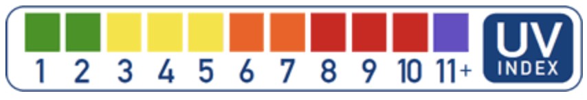
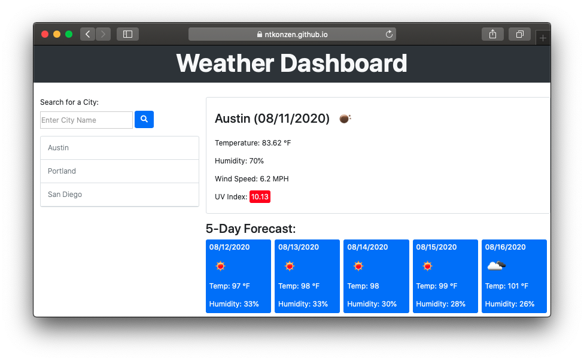

# Weather Dashboard #

#### Table of Contents ####
* [Description](#description)
* [How to Use](#how-to-use-the-weather-dashboard)
* [Features](#features)
---

This is a fully functional international weather dashboard with current weather, a 5-day forecast, and a dynamic search history bar. I created this project to practice my ajax and general jQuery skills as well as offer an easy to use worldwide weather dashboard for anyone who wants one. I learned quite a bit about ajax syntax and the different ways you can manipulate the data you receive from api queries. One of the outstanding features of this dashboard would be the color indication of the UV Index which I modelled after the US Environmental Protection Agency(EPA), as shown below.

[Read further about the UV Index and the danger of UV light rays on the EPA website](https://www.epa.gov/sunsafety/uv-index-scale-0)

## How to Use the Weather Dashboard ##

[Link to Deployed Application](https://ntkonzen.github.io/Weather-Dashboard/)

1. By default, the city presented to you will be San Diego, but if you want to see the weather for a new city, enter whatever city you like into the search bar in the top left and click 'enter' or hit the search button.
    1. If nothing changes and the search bar flashes red, you may have made a spelling mistake, so please adjust your input accordingly and try again
1. Repeat step 1 as many times as you like!
1. When you want to remove a city from the history bar, hover over the city in the history bar and click the 'x' that pops up.
1. If you're planning to go out for the day, search for your city and pay attention to the UV Index. The higher the number, the more damage your skin can take when exposed to the sun that day. Read more about this topic [here](https://www.epa.gov/sunsafety/uv-index-scale-0).

### Features ###

* A main weather section that displays the current weather of whatever city was searched for
* A five day forecast of the selected city at near-noon
* A UV Index indicator that displays it's color based on the severity of current UV exposure
* Icons that display what kind of clouds and atmospheric weather one can expect 
* A history bar where each city is removeable
    * Notice that when you only have one city left in the history bar, you are disallowed from removing that city
* A search bar that provides feedback if the user enters a city that doesn't exist or is spelled incorrectly

---
Copyright (c) 2020 Konzen, Nicholas

Permission is hereby granted, free of charge, to any person obtaining a copy
of this software and associated documentation files (the "Software"), to deal
in the Software without restriction, including without limitation the rights
to use, copy, modify, merge, publish, distribute, sublicense, and/or sell
copies of the Software, and to permit persons to whom the Software is
furnished to do so, subject to the following conditions:

The above copyright notice and this permission notice shall be included in all
copies or substantial portions of the Software.

THE SOFTWARE IS PROVIDED "AS IS", WITHOUT WARRANTY OF ANY KIND, EXPRESS OR
IMPLIED, INCLUDING BUT NOT LIMITED TO THE WARRANTIES OF MERCHANTABILITY,
FITNESS FOR A PARTICULAR PURPOSE AND NONINFRINGEMENT. IN NO EVENT SHALL THE
AUTHORS OR COPYRIGHT HOLDERS BE LIABLE FOR ANY CLAIM, DAMAGES OR OTHER
LIABILITY, WHETHER IN AN ACTION OF CONTRACT, TORT OR OTHERWISE, ARISING FROM,
OUT OF OR IN CONNECTION WITH THE SOFTWARE OR THE USE OR OTHER DEALINGS IN THE
SOFTWARE.